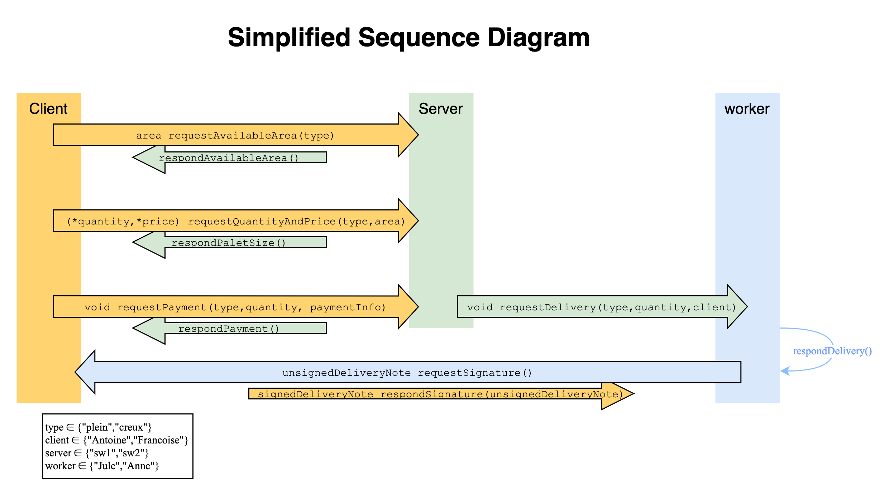
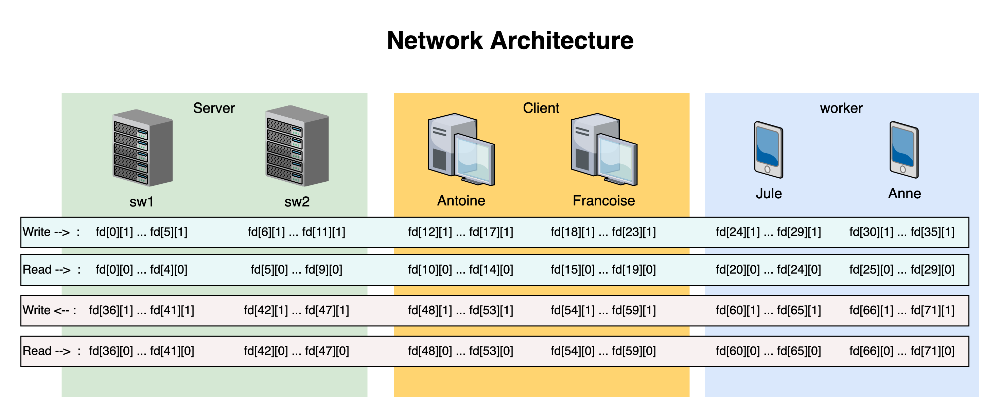

# Unix Process Undergraduate Project



## Expected Terminal Output
```
Antoine : Je demande à sw1 combien de palettes de type plein est-je besoin pour une surface de 40.00 m^2 et combien cela me coutera
Antoine : sw1 me repond qu'il me faudra acheter 20 palettes aux prix de 119.80€

Antoine : J'achète (par le serveur sw1) 20 palettes de type plein.
 - Numero Carte de Paiement : 5412751234123456
 - Cryptogramme : 274
sw1 : Je demande à Jule de livrer un colis de 20 palettes de type plein à Antoine.
Antoine : Succès du paiement de 20 palettes de type plein pour 119.80€.

Jule : Je demande à Antoine de signer un des deux bon de livraison.
Jule : Antoine m'a rendu le bon de livraison signé.
```

Il est possible que [Online GDB](https://www.onlinegdb.com/online_c_compiler) ne retourne pas tous les prints ci dessus(pour des raisons que nous n'avons pas réussi à determiner).
Les autres compilateurs en ligne comme [Programiz](https://www.programiz.com/c-programming/online-compiler/) fonctionne parfaitement


