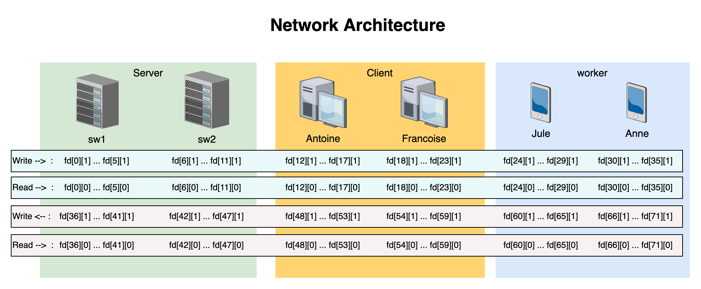

# Unix Process Undergraduate Project


## Expected Terminal Output
```
Antoine : Je demande à sw1 combien de palettes de type [plein] ai-je besoin pour une surface de 40.00 m^2 et combien cela me coutera
Antoine : sw1 me repond qu'il me faudra acheter 20 palettes aux prix de 119.80€

Antoine : J'achète (par le serveur sw1) 20 palettes de type [plein].
 - Numero Carte de Paiement : 5412751234123456
 - Cryptogramme : 274
Antoine : Succès du paiement de 20 palettes de type [plein] pour 119.80€.

sw1 : Je demande à Jule de livrer un colis de 20 palettes de type [plein] à Antoine.
Jule : Je demande à Antoine de signer un des deux bons de livraison.
Jule : Antoine m'a rendu le bon de livraison signé.
```

Il arrive que [Online GDB](https://www.onlinegdb.com/online_c_compiler) ne retourne parfois pas tous les printf ci dessus,souvent les deux derniers (pour des raisons que nous n'avons pas réussi à determiner).

Si besoin, les autres compilateurs en ligne comme [Programiz](https://www.programiz.com/c-programming/online-compiler/) fonctionnent parfaitement avec un comportement plus proche de nos machines.


